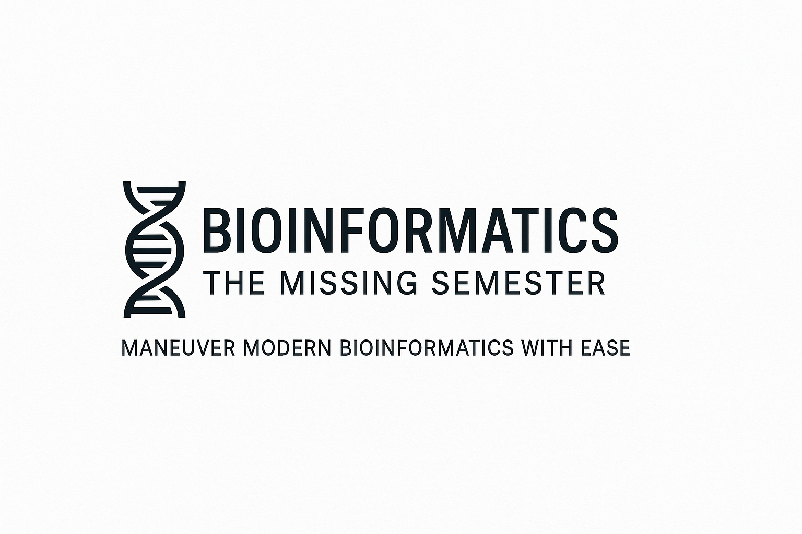

# Bioinformatics: The Missing Semester

Dump of data, notebooks and environment files for [The Missing Semester](https://themissingsemester.substack.com/p/bioinformatics-the-missing-semester) Substack series.

# Scope

Module 1: Data types
- Lesson 1: RNA transcriptomics
- Lesson 2: Spatial transcriptomics
- Lesson 3: Proteomics

Module 2: Multi-omics
- Multimodal data integration

Module 3: Reproducibility & Scale
- Lesson 1: Docker containerization
- Lesson 2: Parallel computing
- Lesson 3: Nextflow workflows

Module 4: AI
- Language models in multi-omics